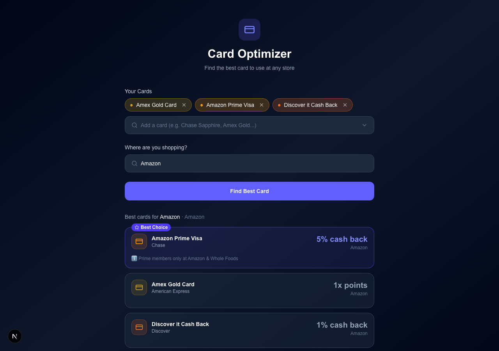
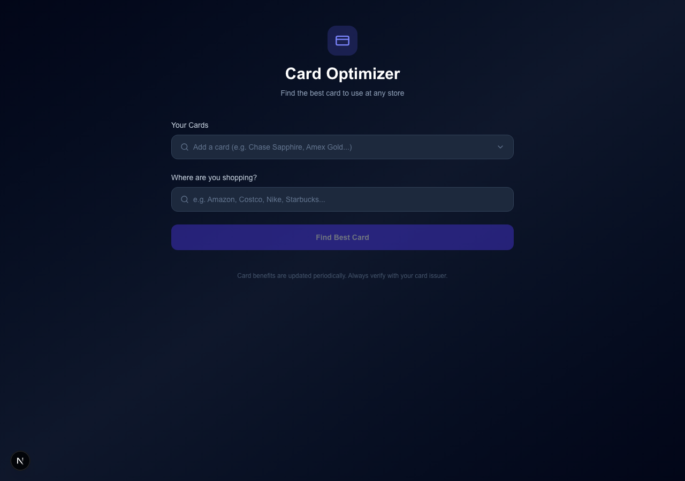

# CardWise 💳

> Never leave rewards on the table. CardWise tells you exactly which credit card to use at any store.



## The Problem

You have multiple credit cards. Each one earns different rewards at different stores — 5% here, 3x points there, rotating categories that change every quarter. Keeping track of it all is a full-time job.

CardWise solves this with a simple question: **where are you shopping?** It tells you which card in your wallet earns the most.

## Features

- 🔍 **Search any store** — Amazon, Costco, Nike, Starbucks, and 40+ more preloaded
- 💳 **Your cards, your wallet** — add the cards you actually own
- 🏆 **Instant ranked recommendations** — best card at the top, every time
- 🔄 **Rotating category support** — Discover 5%, Chase Freedom Flex, and others tracked with active dates
- ⚠️ **Smart warnings** — activation reminders, spend caps, expiry dates
- 🌙 **Dark mode UI** — easy on the eyes

## How It Works

1. Add the credit cards you own
2. Type where you're shopping
3. See which card wins and why

CardWise maps merchants to reward categories and cross-references them against each card's current benefit structure — including rotating quarterly bonuses that card issuers change every few months.

## Supported Cards (18 cards, expanding)

| Issuer | Cards |
|--------|-------|
| Chase | Sapphire Preferred, Sapphire Reserve, Freedom Unlimited, Freedom Flex |
| American Express | Gold, Platinum, Blue Cash Preferred, Blue Cash Everyday |
| Citi | Double Cash, Custom Cash |
| Capital One | Venture X, Savor Cash Rewards |
| Discover | Discover it Cash Back |
| Others | Amazon Prime Visa, Apple Card, Wells Fargo Active Cash, Bank of America Travel Rewards, US Bank Cash+ |

## Screenshots

### Empty State


### Recommendations


## Tech Stack

- **Frontend**: Next.js 14 (App Router) + Tailwind CSS
- **Backend**: Next.js API Routes
- **Database**: SQLite via `better-sqlite3`
- **Automation**: Playwright (for future benefit crawling)

## Getting Started

```bash
# Install dependencies
npm install

# Run dev server
npm run dev
```

Open [http://localhost:3000](http://localhost:3000).

No API keys. No accounts. No setup. Just open and use.

## Architecture

```
src/
├── app/
│   ├── page.tsx              # Main UI
│   └── api/
│       ├── cards/            # GET all cards
│       ├── merchants/        # GET merchant search
│       └── recommend/        # POST recommendation engine
├── db/
│   ├── schema.ts             # SQLite schema + connection
│   └── seed.ts               # Card benefits seed data
└── lib/
    └── recommend.ts          # Core recommendation logic
```

### Recommendation Logic

Given a set of card IDs and a merchant query:

1. Fuzzy-match the merchant name/domain to known merchants
2. Map merchant → category (e.g. Whole Foods → Groceries)
3. For each card, find the best matching benefit:
   - Merchant-specific benefit (highest priority)
   - Category benefit
   - Base reward rate (fallback)
4. Sort by effective rate, accounting for points vs. cashback value

### Rotating Categories

Cards like Discover it and Chase Freedom Flex offer 5% on rotating categories that change quarterly. These are modeled with `valid_from` / `valid_until` date ranges and `requires_activation` flags, so CardWise only shows them when they're currently active.

## Roadmap

- [ ] **Benefit crawler** — automatically scrape card issuer pages and update rates
- [ ] **User accounts** — save your wallet so you don't re-enter cards each time
- [ ] **More cards** — expand to 50+ cards
- [ ] **Mobile app** — React Native version
- [ ] **Browser extension** — auto-suggest best card when checking out online
- [ ] **Points valuation** — factor in transfer partners and redemption values

## Contributing

Pull requests welcome! The most valuable contribution right now is keeping `src/db/seed.ts` up to date with current card benefits.

## License

MIT
